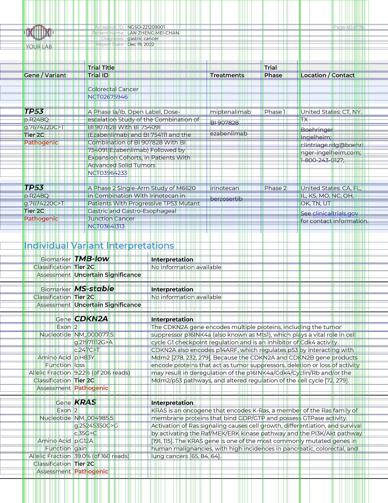
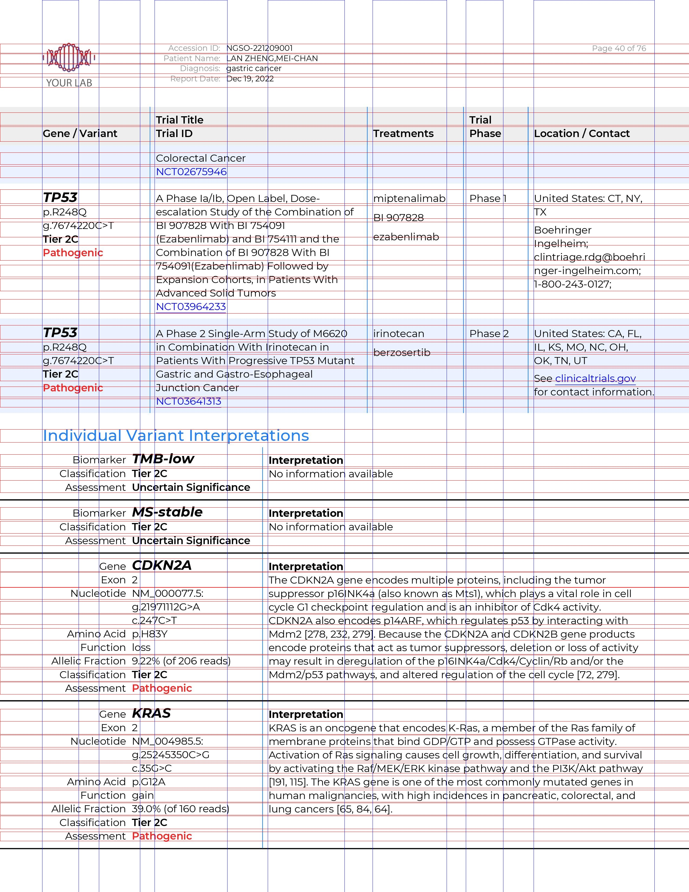

# PADDLEOCR Multi Table Scanning Tool 
The PaddleOCR Multi tool is a model function written to encase the functions of the PaddleOCR New file, which scans cancer patient information into an indexed table. Table headers include the Accession ID, Patient Name, and Diagnosis. The primary features within the columns include Therapies for Other Indicators, Gene/Variant, Response, Therapies Description, Trial Title and ID, Treatments, Trial Phase, Location/Contacts of Individual Trials, and Therapy Response and Description.

PaddleOCR New utilizes the OCR model to train column and horizontal recognition to generate boxes that allows the imaging tool to pick out texts for prediction. Written in an iPython notebook, the file contains around 65 cells and approximately 2000 lines of code. The end result is able to simply convert a single pdf page into a csv table file. 

### **Given a table document we are able to run horizontal and vertical boxes**

### **Using Non Max Suppression we can select lines that contain the most overlap**

### **Text within the boxes are select by calculating the intersections**

### **In order to correctly group row entries I used the PIL Image package to get the RGB values of the topleft pixel of each box, and merged rows accordingly**

### **Concatenating 40 pages of report**

### Currently figuring out how to distinguish and group the second type of table where row entries do not alternate colors. Can add condition to currrent function or write another specifically for the other range.
